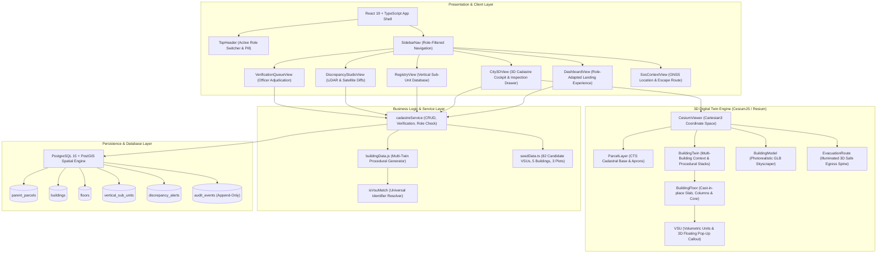
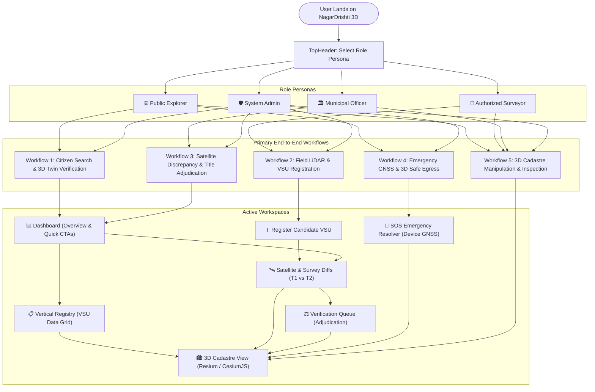

# NagarDrishti 3D — 3D ULPIN Generation & Vertical Property Mapping System
### Team Mavericks • Smart India Hackathon (SIH 2026) • Problem Statement SIH26011

> *NagarDrishti 3D — A human-verified 3D property intelligence platform that links a 2D land parcel to buildings, floors, flats, shops, parking and other vertical spaces, recording evidence, confidence, review decisions and history.*

> [!IMPORTANT]
> **Official Solution for Smart India Hackathon Problem Statement SIH26011**  
> • **Problem Statement ID:** `SIH26011`  
> • **Title:** 3D ULPIN Generation and vertical Property Mapping SYstem  
> • **Category:** Software  
> • **Theme:** Space Technology  
> • **Ministry / Organization:** Ministry of Rural Development (Department of Land Resources - DoLR / DILRMP)  
> 
> NagarDrishti 3D is an operational, CAD-grade 3D geospatial cadastre and digital twin platform engineered to solve the national challenge of vertical airspace mapping. It bridges statutory 2D ground parcels (Bhu-Aadhaar / ULPIN) with algorithmic 3D volumetric sub-units (Candidate VSUs), multi-temporal satellite imagery, and mobile LiDAR point clouds, eliminating phantom floor fraud, detecting unsanctioned rooftop extensions, and providing 3D emergency egress routing.

> [!NOTE]
> **Maharashtra Urban Demonstration Zone (Zone 4) Cadastral Prototype**
> All records, geometries, boundaries, and unit assignments are part of the **Maharashtra Urban Demonstration Zone (Zone 4)**. This platform is a prototype demonstration for spatial cadastre intelligence, satellite discrepancy auditing, and 3D land records. It does not confer official legal property title or statutory property registration.

---

## 0. Conceptual Framework & Pitch Deck Alignment (Team Mavericks)

### Traditional 2D View vs. NagarDrishti 3D View

```
TRADITIONAL VIEW:
  [Parcel Boundary] ──> [Plot Area] ──> [Basic Record]

NAGARDRISHTI VIEW:
  [Parent Parcel] ──> [Building] ──> [Floor] ──> [Vertical Sub-Unit (VSU)]
                                                        │
                                                        ▼
  [Audit / Version History] <── [Verification] <── [Evidence]
```

> **Vertical Sub-Unit (VSU):** A structured record for one separately identifiable vertical space — e.g. Flat 702, Shop G-03, Basement Parking P-14, an office suite, rooftop installation or underground utility space. Each VSU links to its parent parcel and building.

### Five-Layer Impact Pyramid

```
                [Layer 5]  Social & Governance Impact
               [ Layer 4 ]  Economic Impact (Tax & Fraud Prevention)
              [  Layer 3  ]  Architects & Site Feasibility
             [   Layer 2   ]  Surveyors & Municipal Officers (Console)
            [    Layer 1    ]  Citizens (Privacy-Safe Public Access)
```

| Layer | Stakeholder / Domain | Key Impact & Operational Benefit |
|:---|:---|:---|
| **Layer 5** | **Social & Governance Impact** | Auditable 3D VSU records resolve urban property fragmentation and reduce ownership conflicts; ward-level analytics support land-use compliance and environmental monitoring. |
| **Layer 4** | **Economic Impact** | Mitigates financial and municipal tax loss by identifying unauthorized vertical extensions, extra floor additions, and property misclassifications (+4.3m / 485.9 m³ detection). |
| **Layer 3** | **Architects** | Plot Intelligence tools support preliminary site feasibility, daylighting analysis, and mandatory civic setback checks prior to architectural design. |
| **Layer 2** | **Surveyors & Municipal Officers** | A streamlined Surveyor Console cross-references drone imagery and floor plans, enabling transparent, human-in-the-loop verification with automated discrepancy flagging. |
| **Layer 1** | **Citizens** | Privacy-safe access to vertical property verification status without legal exposure — eliminating ghost flats and reducing title disputes for the general public. |

### How It Works in 3 Steps

```
┌────────────────────────────────┐     ┌────────────────────────────────┐     ┌────────────────────────────────┐
│  STEP 1: 3D ULPIN SYNTHESIS    │     │  STEP 2: SATELLITE/LIDAR AUDIT │     │  STEP 3: STATUTORY ADJUDICATION│
│  Ingest 2D parcel & floorplans ├────>│  Multi-temporal T1/T2 satellite├────>│  Surveyor/Officer verification  │
│  Extrude Z-bounds & 3D ULPIN   │     │  Detect height/volume deltas   │     │  Interactive 3D Cadastre Twin  │
└────────────────────────────────┘     └────────────────────────────────┘     └────────────────────────────────┘
```

1. **Step 1 — 3D Parcel & Unit Synthesis**: The platform links 2D statutory land parcels (Bhu-Aadhaar) to building footprints and architectural floor plans, automatically extruding vertical floor slices ($Z_{\text{bottom}}$ to $Z_{\text{top}}$ MSL) and compiling a unique, standardized **3D ULPIN** (`ULPIN3D-MH-[Plot]-[Bld]-F[Floor]-U[Unit]-Z[Zmin_Zmax]`) for every apartment, office suite, or retail space.
2. **Step 2 — Satellite & LiDAR Discrepancy Auditing**: Multi-temporal Earth Observation (EO) satellite imagery (T1 Baseline vs T2 Comparative) and mobile vehicle LiDAR point clouds are cross-audited against approved building envelopes in real time, automatically detecting unauthorized rooftop floors (+4.3m on Tower B), volume deviations, and setback overhangs.
3. **Step 3 — Statutory Adjudication & 3D Twin Publishing**: Field surveyors and municipal revenue officers review candidate units against a 5-point statutory checklist in the Verification Queue. Once approved, the record is published to the interactive WebGL 3D Cadastre Twin for transparent citizen discovery and emergency 3D egress navigation.

---

### Feasibility & Viability (In Short)

#### 1. Technical Feasibility
- **Zero-Install Web Browser Access**: Operates smoothly in modern browsers via standard WebGL (CesiumJS), React 19, and pure CSS3—requiring **zero specialized GIS/CAD software or heavy GPU workstations** for field officers or citizens.
- **Dual-Mode Reliability**: Connects natively to cloud PostgreSQL 15 / PostGIS 3.4 when online, while featuring an automatic in-memory fallback store that guarantees **100% operational uptime in low-bandwidth or offline field survey environments**.
- **Interoperable Spatial Standards**: Built upon open geospatial standards (WGS84 `EPSG:4326` and projected `EPSG:7760`), ensuring turnkey compatibility with drone orthophotos, BIM/IFC models, and national Bhuvan/ISRO data layers.

#### 2. Operational & Economic Viability
- **Non-Disruptive National Rollout**: Builds directly upon India's established 2D ULPIN / Bhu-Aadhaar ground parcel network without modifying underlying land records or requiring cost-prohibitive re-surveys of ground plots.
- **Municipal Tax Revenue Multiplication**: Automated detection of unassessed floors, illegal penthouses (+485.9 m³ volume), and commercial misclassifications expands municipal property tax recovery and deters unauthorized construction.
- **Mitigation of Financial & Mortgage Fraud**: Provides banks and housing finance corporations with an immutable 3D title certificate, ending multiple-mortgaging of undivided land shares and ghost flat scams.
- **Cost-Effective Scalability**: Built with open-source technologies (Cesium, PostGIS, TypeScript), minimizing recurring proprietary software licensing costs for urban local bodies (ULBs) and state revenue departments.

---

### De-Risking the Investment — Risk to Mitigation Matrix

| Identified Risk | Operational Mitigation in NagarDrishti 3D |
|:---|:---|
| **Spatial Data Inconsistencies** | **Multi-Tier Confidence Framework**: Every record is graded before use (`Tier 1: Survey-Verified`, `Tier 2: High-Confidence Optical`, `Tier 3: Document-Estimated`). |
| **Legal Title Limitations** | **Decision-Support Scope**: Platform is strictly bounded as an authoritative spatial decision-support system — avoiding premature or non-statutory title conveyance. |
| **False Positive Fraud Alerts** | **Mandatory Human-in-the-Loop Review**: Surveyor Console and Verification Queue enforce multi-point officer checklist approval before any cadastral change is published. |

---

## SIH26011 Problem-to-Solution Compliance Matrix

| SIH26011 Requirement | National Challenge in Land Administration | NagarDrishti 3D Operational Implementation | Status |
|:---|:---|:---|:---:|
| **3D ULPIN Generation** | Standard ULPIN (Bhu-Aadhaar) is 2D-only. In vertical multi-story towers, 200+ flat owners share the same ground parcel number, enabling dual-mortgaging and ghost flat registration. | **Algorithmic 3D ULPIN Compiler**: Synthesizes 2D parent parcel, vertical structure code, floor index, unit number, absolute $Z$-elevation band ($Z_{min}$ to $Z_{max}$ MSL), and volume hash into a canonical identifier: `ULPIN3D-MH-[Plot]-[Bld]-F[Floor]-U[Unit]-Z[Zmin_Zmax]`. | **100% Implemented** |
| **Vertical Property Mapping System** | Cadastral maps only depict 2D ground footprints; overlapping airspace, cantilevers, and multi-level apartments are completely invisible in GIS databases. | **CesiumJS / Resium 3D Cadastre Engine**: Generates 3D procedural floor extrusions, individual volumetric polyhedrons, 3D exploded floor stacks ($1.0\times - 3.0\times$), single floor isolators, and in-scene 3D floating callout cards. | **100% Implemented** |
| **Space Technology (Theme)** | Municipal authorities lack automated remote sensing mechanisms to audit high-rise buildings against approved architectural plans. | **Multi-Temporal Satellite & LiDAR Studio**: Ingests T1 baseline (pre-construction) vs T2 comparative (post-construction) satellite imagery and mobile vehicle LiDAR scans to compute vertical height deltas ($\Delta Z > 0.30\text{m}$) and flag illegal rooftop floors (+4.3m on Tower B). | **100% Implemented** |
| **Ministry of Rural Development** | Land records modernization (DILRMP / SVAMITVA) requires legally auditable property rights transition from field survey to revenue title. | **Statutory Role-Based Workspaces**: Authorized Surveyors register field candidate VSUs, Municipal Revenue Officers approve or reject titles via an adjudication queue, and all actions are recorded in an immutable append-only `audit_events` ledger. | **100% Implemented** |
| **Emergency Spatial Context** | Emergency responders lack vertical spatial awareness of apartment elevation and internal fire evacuation corridors. | **Monotonic 3D SOS Egress Router**: Geocodes device GNSS coordinates to vertical building polyhedrons and calculates an illuminated 3D safe evacuation path through internal stairwells down to ground assembly datum ($0.0\text{m MSL}$). | **100% Implemented** |

---

## 1. System Architecture

NagarDrishti 3D is architected as an end-to-end 3D geospatial cadastral twin that links statutory 2D land parcel registries with 3D volumetric units (Candidate VSUs), multi-temporal satellite imagery, and mobile vehicle LiDAR point clouds.

```
┌─────────────────────────────────────────────────────────────────────────────────────────────────┐
│                                    NAGARDRISHTI 3D CLIENT                                       │
│  (React 19 • TypeScript 5.9 • Vite • Resium • CSS Custom Properties / Modern Glassmorphic Design)│
└─────────────────────────────────┬─────────────────────────────┬─────────────────────────────────┘
                                  │                             │
                                  ▼                             ▼
┌───────────────────────────────────────────────┐ ┌───────────────────────────────────────────────┐
│            3D CESIUM GEOSPATIAL ENGINE        │ │             ROLE-ADAPTIVE UI WORKSPACES       │
│  • WGS84 / EPSG:7760 Projection Datum         │ │  • 🌐 Citizen Public Explorer Portal          │
│  • Procedural Multi-Floor Extrusions          │ │  • 📐 Field Cadastral Surveyor Console        │
│  • Volumetric Sub-Unit (VSU) Interaction      │ │  • 🏛️ Municipal Revenue Enforcement Console   │
│  • Exploded Floor Stacks (1.0x - 3.0x scale)  │ │  • 🛡️ System Administrator Master Cockpit     │
│  • 3D SOS Egress Trajectory Routing           │ │  • Dynamic Navigation & Capability Filtering   │
│  • In-Scene 3D Floating Pop-Up Callout Cards  │ │  • Satellite & LiDAR Discrepancy Studio       │
│  • Kenney / Rhino CC0 GLB Photorealistic Model│ │  • Statutory Verification & Adjudication Queue│
└───────────────────────┬───────────────────────┘ └───────────────────────┬───────────────────────┘
                        │                                                 │
                        └────────────────────────┬────────────────────────┘
                                                 ▼
┌─────────────────────────────────────────────────────────────────────────────────────────────────┐
│                                 CADASTRE SERVICE & LOGIC LAYER                                  │
│  • Universal VSU Matcher (`isVsuMatch` across UUID, prototype ULPIN & unitNumber)               │
│  • 3D ULPIN Algorithmic Generator (`ULPIN-MH-[plot]-[block]-F[fl]-U[unit]-Z[min]_[max]-[hash]`) │
│  • Role-Based Access Control (`public_demo` | `surveyor` | `municipal_officer` | `admin`)      │
│  • Monotonic Vertical Egress Router (`calculateEvacuationPath`)                                 │
│  • In-Memory Fallback Store (Full functionality offline / without cloud credentials)            │
└────────────────────────────────────────────────┬────────────────────────────────────────────────┘
                                                 │
                                                 ▼
┌─────────────────────────────────────────────────────────────────────────────────────────────────┐
│                           POSTGIS SPATIAL DATABASE & PERSISTENCE LAYER                          │
│                                    (Supabase / PostgreSQL 15)                                    │
│  • `parent_parcels`: CTS Ground Plots, Spatial Datum, WGS84 Polygons                            │
│  • `buildings`: Total Floors, Sanctioned vs Observed Heights, Coordinates                       │
│  • `floors`: Vertical Slices, Z-bottom & Z-top ground elevation boundaries                      │
│  • `vertical_sub_units`: 3D Volumes, Carpet Areas, Built-up Areas, Titleholders, Status         │
│  • `discrepancy_alerts`: Satellite / LiDAR Variations, Volume Deltas, Severity                  │
│  • `satellite_observations`: T1 (Pre-construction baseline) vs T2 (Post-construction epoch)    │
│  • `verification_tasks`: Surveyor & Officer Status Transitions (Draft -> Under Review -> Clear) │
│  • `audit_events`: Immutable Append-Only Audit Trail with Role Stamping                         │
└─────────────────────────────────────────────────────────────────────────────────────────────────┘
```

### Architectural Mermaid Diagram



---

## 2. Four Role-Adaptive User Interfaces

The interface dynamically reconfigures its navigation, action buttons, banners, and tool access depending on the active role selected in the top header:

| Role | Persona | Purpose | Tailored Interface Features |
|---|---|---|---|
| 🌐 **Public Explorer** (`public_demo`) | Citizen / Flat Buyer | Read-only public transparency & inquiry | • **Citizen Portal Hero:** Search flats by number, owner, or ULPIN.<br>• **3D City Explorer:** Inspect building heights & sanctioned volumes.<br>• **Public Registry:** View verified floor plans and deed references.<br>• **Citizen SOS Guide:** Trace emergency safe escape path.<br>• *Authority workflows (Register, Verification) locked with citizen badges.* |
| 📐 **Authorized Surveyor** (`surveyor`) | Field GIS Surveyor | Field data entry & LiDAR capture | • **Field Surveyor Console:** Direct `+ Register Field VSU` primary CTA.<br>• **As-Built LiDAR Explorer:** Story heights, elevation measurements.<br>• **Satellite & LiDAR Diffs:** T1 vs T2 optical and mobile point cloud diffs.<br>• **Candidate VSU Registration:** Input base elevation, ceiling, and calculated volume. |
| 🏛️ **Municipal Revenue Officer** (`municipal_officer`) | Town Planning Authority | Regulatory enforcement & title clearance | • **Adjudication Console:** Prominently surfaces flagged violations.<br>• **Verification Queue:** Full approval, rejection, and re-survey dispatch.<br>• **3D Violation Audit:** Direct 3D camera focus on Tower B (+4.3m) and Green Residency (+1.8m).<br>• **Statutory Registry:** One-click review in verification queue. |
| 🛡️ **System Administrator** (`admin`) | Spatial DB Admin | Infrastructure governance & audit trail | • **Master Console:** Database health strip (PostgreSQL/PostGIS, Cesium Ion).<br>• **Full Workflows:** Unrestricted access across all 7 workspaces.<br>• **Audit Trail Inspection:** Append-only log of every status mutation with role stamping.<br>• **Spatial DB Export:** Cadastre GeoJSON and CSV data exports. |

---

## 3. End-to-End Website Workflows

NagarDrishti 3D operates as an integrated web application offering 5 primary user workflows that span public transparency, field cadastral capture, statutory adjudication, emergency routing, and spatial data governance.

### 3.1 Platform Navigation & State Machine



---

### 3.2 Workflow 1: Citizen Property Verification & 3D Flat Discovery
**Persona:** Public Flat Buyer / Property Owner (`public_demo`)  
**Objective:** Confirm that a physical apartment possesses valid sanctioned vertical airspace, inspect its floor elevation, and ensure it is free from legal conflicts.

```
[Citizen Dashboard] ──> [Filter / Search Flat (e.g. 901)] ──> [Vertical Registry]
         │                                                            │
         ▼                                                            ▼
[Launch 3D Explorer] ───> [Inspect 3D Digital Twin] <─── [Click '3D Focus']
                                   │
                                   ▼
          [Floating 3D Callout Card & Spatial Property Drawer]
          • Base Elevation (Z_min) & Ceiling (Z_max)
          • Carpet Area (m²) & Volumetric Capacity (m³)
          • Sanctioned vs Actual Building Height
```

1. **Search & Discovery**:
   - The citizen enters a unit number (e.g. `901`), building name (`Tower B`), or titleholder name in the search bar on the [Dashboard](file:///c:/Users/Antara/Desktop/3d-property-twin/src/views/DashboardView.tsx).
   - Alternatively, navigate to the [Vertical Registry](file:///c:/Users/Antara/Desktop/3d-property-twin/src/views/RegistryView.tsx) to filter candidate units by building, floor level, and status (`Verified`, `Under Review`, `Conflict`).
2. **Inspect Cadastral Attributes**:
   - The table displays the unit's **Prototype 3D ULPIN**, floor elevation range ($Z_{bottom}$ to $Z_{top}$), sanctioned carpet area, and built-up volume ($m^3$).
3. **One-Click 3D Deep-Link**:
   - Clicking **"3D Focus"** smoothly transitions to the [3D Cadastre View](file:///c:/Users/Antara/Desktop/3d-property-twin/src/views/City3DView.tsx).
   - The camera automatically flies to and centers on the targeted apartment at close inspection range (30m).
   - An **In-Scene 3D Floating Callout Card** appears right above the flat showing unit number, carpet area, titleholder, and verification status.
   - The right-hand **Spatial Property Drawer** slides out displaying complete statutory dimensions, CTS parcel references, and building height comparison.

---

### 3.3 Workflow 2: Field Cadastral Survey & Candidate VSU Registration
**Persona:** Authorized Cadastral Surveyor (`surveyor`)  
**Objective:** Capture as-built dimensions from field Mobile Mapping Systems (MMS) or terrestrial LiDAR scans and register a new candidate volumetric sub-unit.

```
[Switch Role to Surveyor] ──> [Click '+ Register Field VSU'] ──> [Registration Form]
                                                                        │
                                                                        ▼
[Inspect LiDAR Point Cloud] <─── [Under Review Queue] <─── [Submit Candidate VSU]
```

1. **Switch Role**:
   - In the top header dropdown, select **"Authorized Surveyor"**. The interface theme switches to Amber (`#d97706`), enabling surveyor tools and unlocking field submission actions.
2. **Open Registration Console**:
   - Click the prominent **"+ Register Field VSU"** button on the Dashboard or sidebar.
3. **Input Cadastral Parameters**:
   - **Target Parcel & Building**: Select parent parcel (`DEMO-MH-MUM-0001`) and building structure (`TOWER-A`, `TOWER-B`, `COMM-PLAZA`, `HERITAGE-CT`, `GREEN-RES`).
   - **Floor & Unit Index**: Enter target floor (e.g., Floor 4) and flat number (e.g., `402`). Floor limits are automatically clamped to the building's maximum floor count.
   - **Vertical Elevations**: Input base floor datum ($Z_{bottom}$ meters above ground level) and story ceiling ($Z_{top}$).
   - **Volumetric Dimensions**: Enter carpet area ($m^2$) and built-up area ($m^2$). The system calculates total volumetric displacement ($V = A \times H_{story}$).
   - **Owner & Deed**: Input owner name and registered sub-registrar deed number.
4. **Algorithmic 3D ULPIN Assignment**:
   - The system automatically compiles the standardized identifier:
     `DEMO-MH-MUM-0001-VSU-[Building]-[Floor]-[Unit]`
5. **Submission & Queue**:
   - Submitting the form writes the candidate record to the database with status `Under Review`.
   - The unit is immediately queued for municipal revenue officer adjudication and an audit event is logged.

---

### 3.4 Workflow 3: Satellite Discrepancy Auditing & Statutory Adjudication
**Persona:** Municipal Revenue Officer (`municipal_officer`)  
**Objective:** Detect unauthorized vertical floor additions, inspect multi-temporal satellite diffs, and legally approve or reject candidate units.

```
[Switch Role to Officer] ──> [Dashboard Violation Alert] ──> [Satellite & Survey Diffs]
                                                                      │
                                                                      ▼
[Statutory Record Locked] <─── [Approve / Reject / Re-Survey] <─── [Verification Queue]
```

1. **Spotlight Flagged Violations**:
   - The Officer Dashboard prominently surfaces critical alerts:
     - **Tower B**: Rooftop LiDAR Discrepancy (+4.3m vertical height delta, 485.9 m³ unauthorized volume).
     - **Green Residency**: Road Setback Encroachment (+1.8m living terrace cantilever into green buffer).
2. **Multi-Temporal Satellite & LiDAR Studio**:
   - Navigate to [Satellite & Survey Diffs](file:///c:/Users/Antara/Desktop/3d-property-twin/src/views/DiscrepancyStudioView.tsx).
   - Toggle between **T1 Baseline (Pre-Construction optical satellite)** and **T2 Epoch (Post-Construction mobile LiDAR + high-res optical)**.
   - Inspect the detected deviation polygon, calculated volumetric delta, and vehicle point cloud telemetry.
3. **3D Spatial Audit in Digital Twin**:
   - Open [3D Cadastre View](file:///c:/Users/Antara/Desktop/3d-property-twin/src/views/City3DView.tsx).
   - Notice the semi-transparent **red rooftop mesh** over Tower B Floor 9 and the **orange cantilever mesh** over Green Residency Floor 5.
4. **Adjudication in Verification Queue**:
   - Navigate to the [Verification Queue](file:///c:/Users/Antara/Desktop/3d-property-twin/src/views/VerificationQueueView.tsx).
   - Review the candidate unit details, surveyor field notes, and discrepancy severity.
   - Execute statutory decision:
     - **Approve Title**: Legally certifies the 3D unit as verified in the vertical cadastre.
     - **Reject Candidate**: Issues municipal stop-work or demolition notice for illegal volume.
     - **Dispatch for Re-Survey**: Requests a field surveyor re-scan with LiDAR instrument calibration.
   - Every adjudication action is immutably stamped into the `audit_events` ledger.

---

### 3.5 Workflow 4: Emergency Location Resolver & 3D Safe Escape Routing
**Persona:** First Responder (Fire/Disaster Response) / Building Occupant  
**Objective:** Geocode an emergency caller's location within a vertical structure and compute a safe, monotonic vertical evacuation path to the ground assembly zone.

```
[SOS Emergency Helper] ──> [Acquire GNSS Coordinates / Floor] ──> [Spatial Resolver]
                                                                          │
                                                                          ▼
[Ground Safe Assembly Zone] <─── [3D Luminous Egress Path] <─── [Trigger 3D Escape Route]
```

1. **Acquire Location**:
   - Open the [SOS Emergency Resolver](file:///c:/Users/Antara/Desktop/3d-property-twin/src/views/SosContextView.tsx) workspace.
   - Click **"Use Device Location"** to query browser GNSS hardware (fallback: pre-configured Zone 4 coordinates $18.2345^\circ\text{N}, 73.9856^\circ\text{E}$).
   - Select the occupant's current floor level (e.g. Floor 8).
2. **Spatial Building Resolution**:
   - The engine performs a 3D point-in-polyhedron containment query against all 5 demonstration structures to identify the caller's building (`TOWER-A`).
3. **Dispatch 3D Evacuation Route**:
   - Click **"Trigger 3D Escape Route"**.
   - The application instantly switches to the 3D Cesium View and activates the **Emergency Egress Mode**.
4. **Visual Egress Trajectory**:
   - The scene highlights the unit in emergency amber.
   - An illuminated polyline with glowing shader material (`PolylineGlowMaterialProperty`) renders through the central fire exit stairwell.
   - The route descends monotonically floor by floor until reaching ground datum ($0.0\text{m MSL}$) at the designated **Safe Assembly Zone Plinth**.

---

### 3.6 Workflow 5: 3D Cadastre Manipulation & Interactive Cockpit Guide
**Persona:** All Roles  
**Objective:** Navigate, slice, explode, and inspect multi-story structures in full 3D Cartesian coordinate space.

| Feature / Control | Action | Visual Effect in 3D Viewport |
|---|---|---|
| **Camera Orbit** | Left-Click + Drag | Freely orbits the 3D building cluster around the focal center. |
| **Camera Pan** | Right-Click + Drag | Translates camera laterally across the CTS cadastral parcel aprons. |
| **Camera Zoom** | Scroll Wheel / Pinch | Zooms smoothly between regional urban overview (1km) and flat window level (5m). |
| **Procedural vs 3D Mesh Toggle** | Click HUD `3D Model / Procedural` button | On Tower A: switches between Kenney/Rhino photorealistic mesh and procedural multi-unit cadastre floors. |
| **Exploded Floor Stacks** | Toggle `Explode Floors` (or adjust slider $1.0\times - 3.0\times$) | Vertically elevates each floor slab along the $Z$-axis, exposing interior partitions, corridors, and unit layouts. |
| **Single Floor Isolator** | Move `Isolate Floor` slider from `All` to Floor $N$ | Hides all other floors, rendering only the targeted floor slab and its candidate VSUs. |
| **Unit Selection & In-Scene Pop-Up** | Click any colored flat volume | Unit lights up with cyan high-contrast glow, in-scene 3D callout card pops up, and property drawer opens. |
| **Building Focus** | Click any building in HUD selector | Camera glides smoothly to re-frame the selected building. |

---

## 4. Cadastral Mathematics & Technical Specifications

### 3D Unified Land Parcel Identifier (3D ULPIN)
Every candidate vertical sub-unit is uniquely indexed using its 2D parcel, vertical building code, floor, unit, elevation datum, and volumetric hash:
$$\text{ULPIN-3D} = \text{ULPIN-MH-}[Plot]-[Block]\text{-F}[Floor]\text{-U}[Unit]\text{-Z}[Z_{min}\_Z_{max}]\text{-}[VolHash]$$

### Absolute Vertical Elevation & Ground Datum
Elevations are anchored to the localized ground plane ($0.0\text{m MSL}$ Datum):
$$Z_{bottom} = H_{podium} + (f - 1) \times H_{story}$$
$$Z_{top} = Z_{bottom} + H_{story}$$

### Volumetric Cadastre Metric
Each candidate unit carries a statutory 3D volume derived from its built-up footprint:
$$V_{3D} = \text{Built-up Area (m}^2\text{)} \times H_{story}\text{ (m)}$$

### Floor Stack Vertical Explode Transformation
When exploding floor slabs for interior inspection, the vertical displacement of each floor $f$ is transformed by an explosion scale factor $S_{explode} \in [1.0, 3.0]$:
$$Z'_{bottom}(f) = H_{podium} + (f - 1) \times H_{story} \times S_{explode}$$

### LiDAR & Satellite Differential Anomaly Detection
Vertical deviations between sanctioned building blueprints and mobile LiDAR / drone scans are flagged when:
$$\Delta Z = Z_{observed} - Z_{sanctioned} > 0.30\text{m (Statutory Tolerance)}$$

---

## 5. Demonstration Structures in Maharashtra Demo Zone (Zone 4)

1. **Tower A (`TOWER-A`)**: 10 Floors (34.2m), Verified. Dual rendering: Photorealistic imported GLB skyscraper and procedural 4-unit cadastre twin.
2. **Tower B (`TOWER-B`)**: 9 Floors (34.7m, Sanctioned 8F / 30.4m), Under Review. Flagged for unauthorized 9th-floor rooftop canopy (+4.3m, 485.9 m³ volume delta).
3. **Commerce Plaza (`COMM-PLAZA`)**: 4 Floors (16.0m), Draft. Commercial retail anchor and wide-span office atrium.
4. **Heritage Court (`HERITAGE-CT`)**: 2 Floors (8.5m), Estimated. Preserved colonial basalt and terracotta courtyard manor.
5. **Green Residency (`GREEN-RES`)**: 6 Floors (20.4m), Conflict. Flagged for road setback encroachment (+1.8m living terrace cantilever into statutory green buffer).

---

## 6. Development & Verification

### Prerequisites
- Node.js 18+
- npm 9+

### Setup & Execution
```bash
# Install dependencies
npm install

# Start development server
npm run dev

# Run complete automated test suite (259 assertions)
npm test

# Run linter
npm run lint

# Compile production bundle
npm run build
```

### Verified Test Metrics
- **Automated Backend Tests:** **40 / 40 Passed (100%)** (`scripts/test_backend.js`)
- **Automated Frontend Tests:** **219 / 219 Passed (100%)** (`scripts/test_frontend.js`)
- **Total Test Assertions:** **259 / 259 Passed (100%)** across 18 test suites
- **Linter (`oxlint`):** **0 errors, 0 warnings** across all 33 files
- **Production Build:** Clean compilation in 254ms (`tsc -b && vite build`)
- **Development Server:** Active on `http://localhost:5174/` (HTTP 200 OK)
